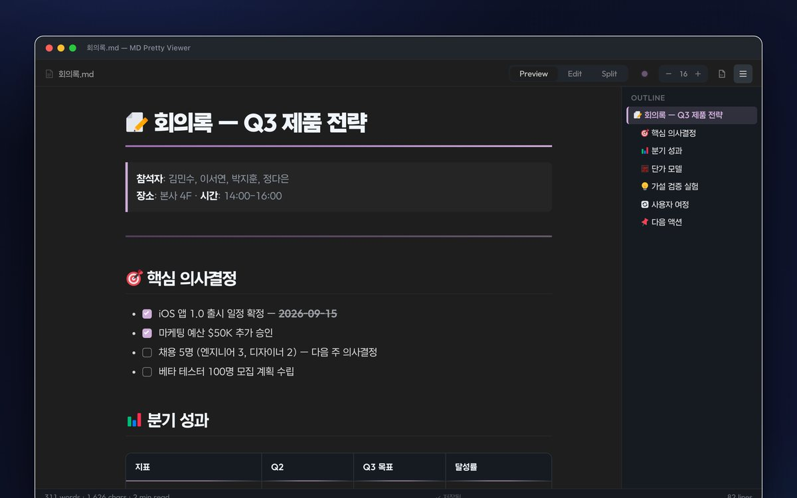
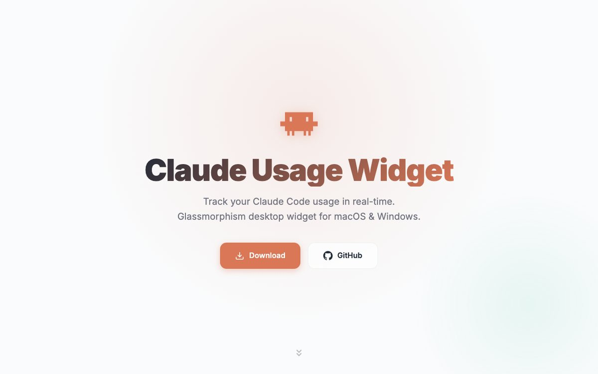
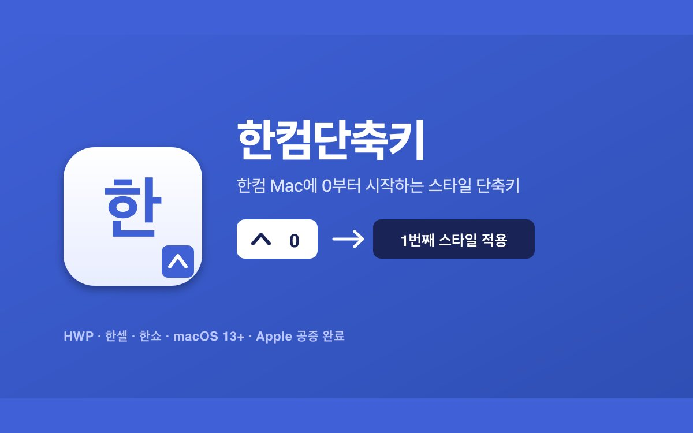
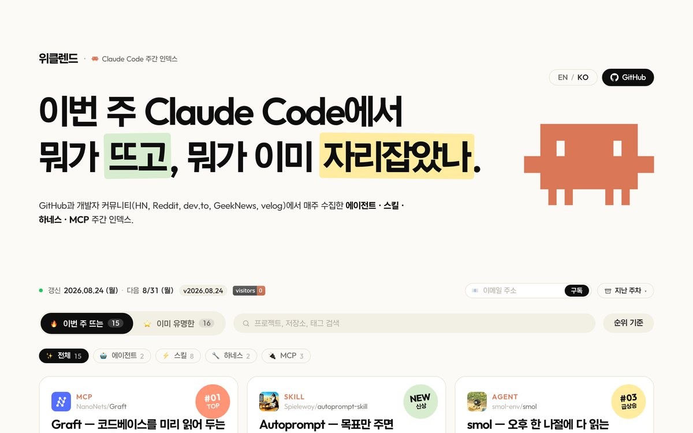
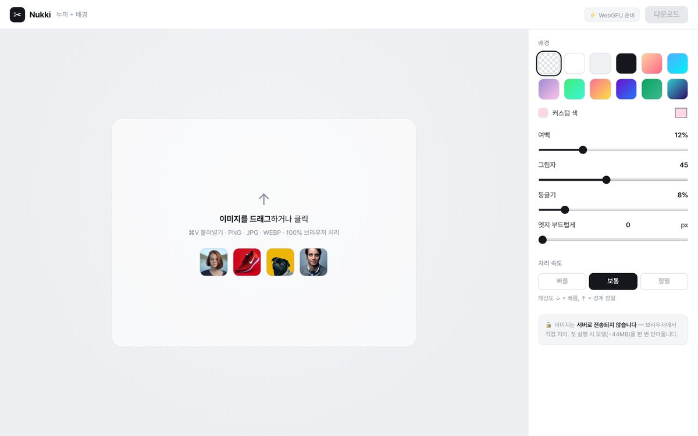
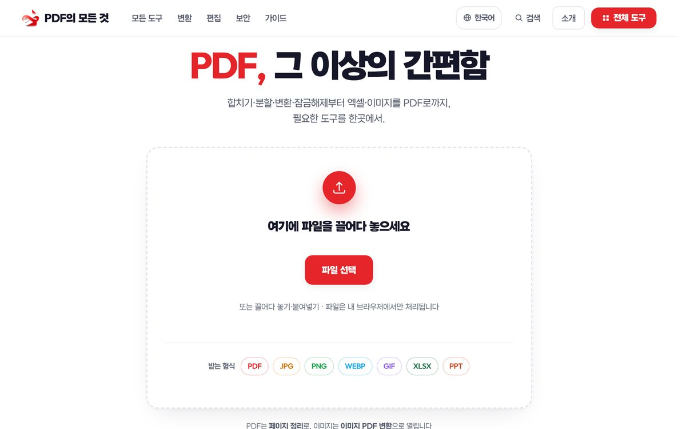
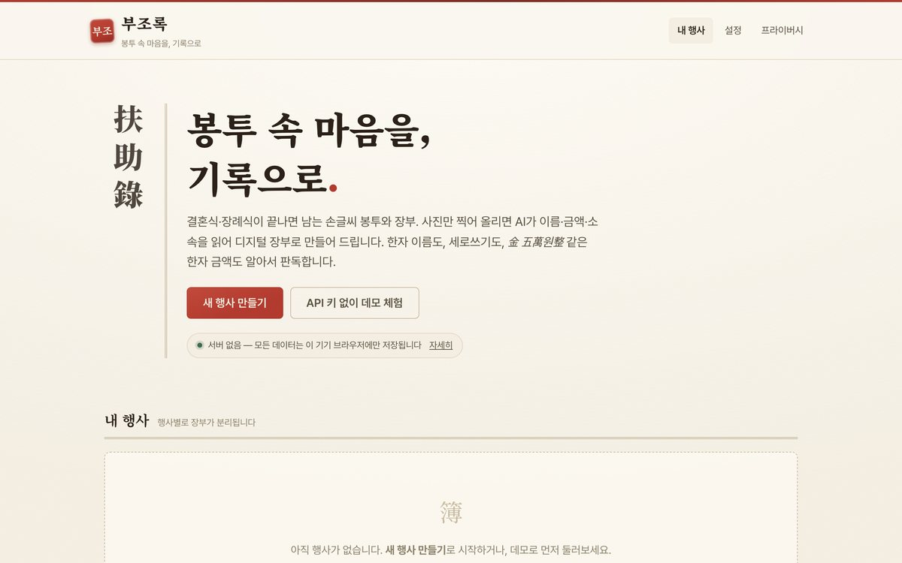
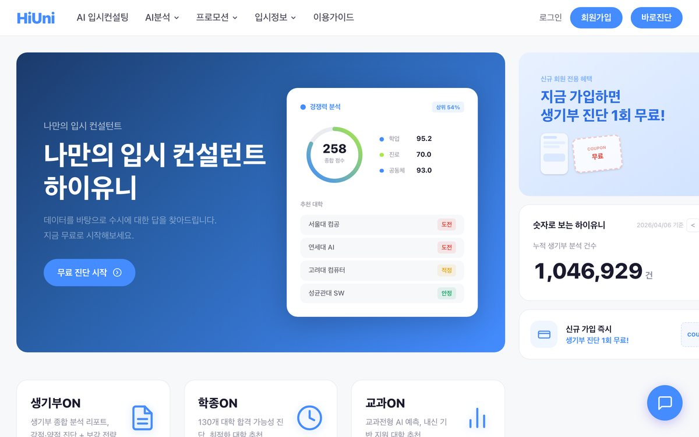
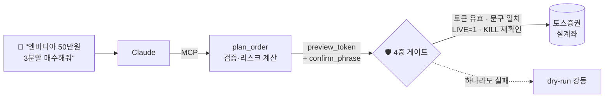

  

 

## 👋 About

LLM 에이전트가 **실제 계좌·실제 사용자**를 다룰 때 무너지지 않게 만드는 일을 합니다.
기능보다 안전장치와 검증을 먼저 설계하고, 스토어·공증·배포까지 끝까지 가져갑니다.

- 🏢 **(주)이노하이 대표** · 2025.06 – 현재
- 🎓 동국대학교 정보통신공학 · 데이터사이언스 복수전공 (2025.08 졸업)

 

## 📊 Shipped, by the numbers

| 🧩 VS Code 확장 설치 | 🍎 macOS 앱 다운로드 | 🚀 공개 릴리스 | ✅ 유닛 테스트 |
|:---:|:---:|:---:|:---:|
| **1,500+** | **1,000+** | **96+** | **304** |
| MD Pretty Viewer · HTML Live Viewer | ClaudeUsageWidget · 한컴단축키 | 3개 제품 누적 | toss-mcp |

 

## 🖼 What I've shipped

<table>
<tr>
<td width="33%" align="center"> <b>MD Pretty Viewer</b> VS Code 확장 · 설치 1,268</td>
<td width="33%" align="center"> <b>Claude Usage Widget</b> macOS 앱 · 다운로드 984</td>
<td width="33%" align="center"> <b>한컴단축키</b> macOS 메뉴바 · Apple 공증</td>
</tr>
<tr>
<td align="center"> <b>위클렌드</b> Claude Code 주간 트렌드 · 자동 갱신</td>
<td align="center"> <b>Nukki</b> 브라우저 온디바이스 배경 제거 AI</td>
<td align="center"> <b>PDF의 모든 것</b> 업로드 없는 PDF 도구</td>
</tr>
<tr>
<td align="center"> <b>부조록</b> 경조사 장부 AI 디지털화</td>
<td align="center"> <b>하이유니</b> 생활기록부 AI 입시 분석</td>
<td align="center"> <b>오늘의 시</b> 매일 한 편 · 한글 공유 카드</td>
</tr>
</table>

이미지를 누르면 실제 서비스로 이동합니다

 

## ⭐ Featured

### [📈 toss-mcp](https://github.com/khwee2000/toss-mcp) — 실계좌를 다루는 LLM 에이전트

Claude × 토스증권 Open API MCP 서버. 자연어로 실계좌를 조회·주문하고, 그 위에서 변동성 적응형 스윙 엔진을 돌린다.
- 실돈이 오가는 주문 경로에 **안전 불변식 13개** 강제 (dry-run 기본 · 이중 확인 · kill-switch · 감사로그)
- 키 없이도 전 기능이 도는 **mock 모드**로 재현 가능한 테스트

### [📝 MD Pretty Viewer](https://github.com/INNO-HI-Inc/md-viewer) — VS Code 마켓플레이스 설치 1,268회

마크다운 프리뷰 확장 — 라이브 편집 · 7개 컬러 테마 · 아웃라인 사이드바.
- 릴리스 **66회** 반복 배포 · [마켓플레이스](https://marketplace.visualstudio.com/items?itemName=innohi.md-pretty-viewer) · [라이브 데모](https://inno-hi-inc.github.io/md-viewer/demo.html)

### [📊 ClaudeUsageWidget](https://github.com/INNO-HI/ClaudeUsageWidget) — macOS 앱 다운로드 984회

Claude Code 사용량을 macOS 메뉴바에서 실시간으로 — burn-rate ETA · 7일 스파크라인 · 알림 · CSV/JSON 내보내기.
- **코드서명·공증 · Sparkle 자동 업데이트 · GitHub Actions 릴리스** 파이프라인 · 릴리스 27회 · 4개 언어 · [사이트](https://inno-hi.github.io/ClaudeUsageWidget/)

### 🤝 안심하이 (SafeHi) — 지자체 돌봄 현장에서 쓰는 앱

지자체 돌봄 매니저용 Flutter 앱. **146커밋**, Play 스토어 심사·배포 담당 *(회사 private 레포 · [데모 대시보드](https://github.com/INNO-HI/safehi-demo))*

 

## 🚢 사용자에게 배포한 도구

| 프로젝트 | 무엇을 | 근거 |
|---|---|---|
| **[HTML Live Viewer](https://github.com/INNO-HI-Inc/html-live-viewer)** | VS Code에서 HTML을 실제 브라우저처럼 실시간 미리보기 | 마켓플레이스 설치 **251회** |
| **[한컴단축키](https://github.com/INNO-HI-Inc/hancom-hotkey)** | Mac 한컴오피스(HWP·한셀·한쇼) 스타일 단축키 메뉴바 앱 | 다운로드 **60회** · Universal binary · Sparkle · [사이트](https://inno-hi-inc.github.io/hancom-hotkey/) |
| **[weeklaude](https://github.com/INNO-HI/weeklaude)** · **[clend](https://github.com/INNO-HI-Inc/clend)** | Claude Code 에이전트·스킬·MCP 주간 트렌드 인덱스 | 매주 월요일 **완전 자동** 수집·갱신 · [weeklaude](https://inno-hi.github.io/weeklaude/) · [clend](https://inno-hi-inc.github.io/clend/) |
| **[mac-special-chars](https://github.com/INNO-HI-Inc/mac-special-chars)** | 맥에서 윈도우 한자키처럼 — ㅁ 특수문자 99종 + ⌥Space 팔레트 | [사이트](https://inno-hi-inc.github.io/mac-special-chars/) |

 

## 🔒 서버로 보내지 않는 AI · 웹앱

> 사용자 데이터는 브라우저 밖으로 나가지 않는다 — 에이전트 안전과 같은 원칙을 웹에도.

| 프로젝트 | 무엇을 | 체험 |
|---|---|---|
| **[nukki](https://github.com/INNO-HI-Inc/nukki)** | 배경 제거 AI(RMBG-1.4)를 `transformers.js`로 **브라우저에서 직접** 실행 · WebGPU → WASM 폴백 | [데모](https://inno-hi-inc.github.io/nukki/) |
| **[부조록](https://github.com/INNO-HI-Inc/bujorok)** | 축의금·부의금 장부 사진을 AI로 디지털 장부화 · 로컬 처리 | [데모](https://inno-hi-inc.github.io/bujorok/) |
| **[all-about-pdf](https://github.com/INNO-HI-Inc/all-about-pdf)** | 업로드 없는 한국어 PDF 도구 (합치기·분할·변환·잠금해제) | [데모](https://inno-hi-inc.github.io/all-about-pdf/) |
| **[이사정산소](https://github.com/INNO-HI-Inc/isa-refund)** | 장기수선충당금 자동 계산 + 반환 서류 생성 | [데모](https://inno-hi-inc.github.io/isa-refund/) |
| **[cstimer-clone](https://github.com/INNO-HI-Inc/cstimer-clone)** | 토스 디자인 언어 스피드큐브 타이머 · WCA 스크램블 16종 · 오프라인 PWA | [데모](https://inno-hi-inc.github.io/cstimer-clone/) |

 

## 🧠 LLM · 데이터 R&D

| 프로젝트 | 무엇을 | 스택 |
|---|---|---|
| **[dacon_crew](https://github.com/khwee2000/dacon_crew)** | 형법 문제 특화 LLM 에이전트 + 답변 생성→채점 자동 평가 파이프라인 | Python · Docker |
| **[A-IDLE](https://github.com/CSID-DGU/2024-1-DSCD-A_IDLE-3)** | 캡스톤 — 생성형 AI 블로그 콘텐츠 자동 작성·SEO·포스팅 | Python |
| **[ojitong](https://github.com/Subworkers/ojitong)** | 뉴스 크롤링 → 지식 선별·주입 프롬프트 엔지니어링 (지하철 소식통) | Python |
| **[MZ 번역기](https://github.com/omz-translation/react-code)** | KE-T5 파인튜닝 + MZ 코퍼스 전이학습으로 신조어 번역 | T5 · React |
| **[MisconcepTutor](https://github.com/Jintonic92/MisconcepTutor)** | 수학 오답의 misconception 분석 → 맞춤 연습문제 생성 | Python |
| **[algoview](https://github.com/Algorithm-Coding-Test-Data-Analysis/algoview)** ⭐20 | 코딩테스트 풀이의 언어별 내장 메서드 사용 빈도 분석 | JS |
| **[dog-recommendation-systems](https://github.com/khwee2000/dog-recommendation-systems)** | 네이버 블로그 크롤링 + TF-IDF 반려견 성격 추천 | Python · KoNLPy |

<b>🏢 INNO-HI 서비스 · 그 밖의 작업</b>

 

- **[HI-Sing](https://github.com/INNO-HI/HI-Sing)** — 노래로 전하는 우리 가족 이야기, 가족 맞춤 노래 스토어 (Next.js)
- **[hi-university](https://github.com/INNO-HI-Inc/hi-university)** — 생활기록부 AI 분석 입시컨설팅 · [사이트](https://inno-hi-inc.github.io/hi-university/)
- **[kidsdiag-app](https://github.com/INNO-HI-Inc/kidsdiag-app)** — 초5 학력진단·AI 심화학습 MVP (한국창의영재교육원 협업)
- **[oneul-news](https://github.com/INNO-HI-Inc/oneul-news)** — 매일 아침 7시 뉴스 브리핑 자동 발행 (iOS 앱 연동)
- **[INNO-HI Website](https://github.com/INNO-HI/Website)** — 회사 웹사이트
- **[khwee2000-poem](https://github.com/khwee2000/khwee2000-poem)** — 매일 한 편 한국 근현대 명시 · `next/og` 한글 공유 카드 · [사이트](https://khwee2000.github.io)
- **[LinkRoom](https://github.com/doit-yb)** — "쉬었음 청년 → 뭘했음 청년", 청년을 정책·사람과 잇는 AI 상담 파트너
- **[ToBig's Tours_Team](https://github.com/Tobigs-DashBoard/Tours_Team)** · **[AI-Care-Report](https://github.com/pauly00/AI-Care-Report)** · **[Close-up](https://github.com/closeup-raffle/AI)** · **[모바일소프트웨어](https://github.com/Acokkini/mobilesoftware)**

 

## 🛠 Tech Stack

| 분야 | 기술 |
|---|---|
| **LLM · Agent** |     |
| **Backend · Data** |     |
| **Client** |      |
| **Ship** |      |

 

## 📌 이전 활동

- 🐯 ToBig's 빅데이터 분석 동아리 · LG Aimers 6기
- ✍️ 『Streamlit Guide: Web App Development』 시각화 파트 집필
- ⚡ 한전MCS ESG 신사업기획팀 인턴 (2024.08 – 09)
- 🎖️ 공군 병장 만기 전역

 

<picture>
  <source media="(prefers-color-scheme: dark)" srcset="https://raw.githubusercontent.com/khwee2000/khwee2000/output/github-snake-dark.svg" />
  
</picture>

